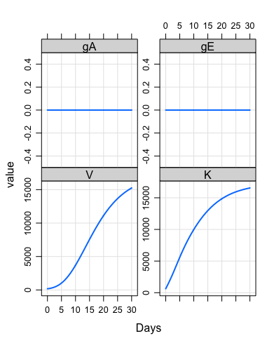
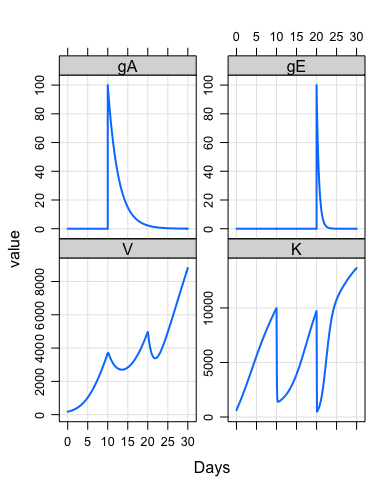
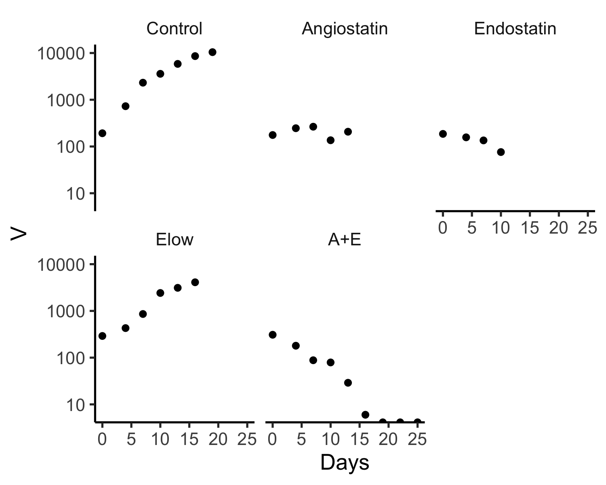
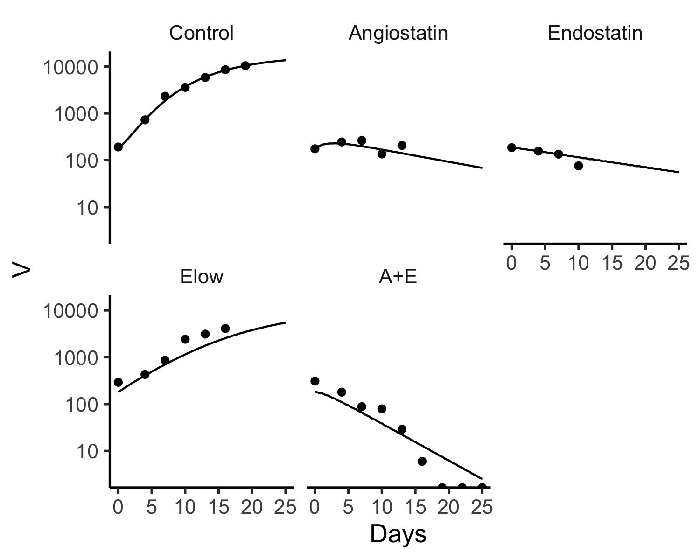
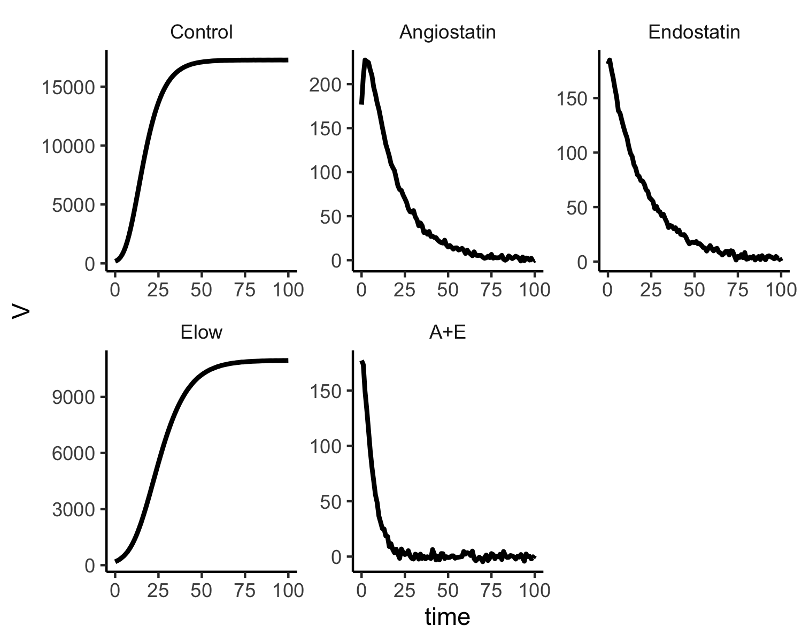

canceR
======

An R package housing dynamical system models of non-myeloid cancers.
To install it use:  
```
devtools::install_github("radivot/canceR",subdir="canceR")
```

# Tumor Development under Angiogenic Signaling: A Dynamical Theory of Tumor Growth, Treatment Response, and Postvascular Dormancy

The model of [Hahnfeldt et al  *Cancer Research* **59** 4770-4775 (1999)](https://www.ncbi.nlm.nih.gov/pubmed/10519381) includes as dynamic state variables the tumor volume V, its  carrying capacity K, and the concentrations gA and gE of angiostatin and endostatin. In R their model is 
```
library(canceR)
hahnfeldt99AE<-function(Time, State, Pars) {
	with(as.list(c(State, Pars)), {
				dV = -lambda1*V*log(V/K)
				dK = -lambda2*K+b*V-d*K*V^.667-eA*K*gA-eE*K*gE
				dgA = -clrA*gA
				dgE = -clrE*gE
				return(list(c(dV,dK,dgA,dgE)))
			})
}
```

and in equivalent but faster C it is 
```
#include <R.h>
static double parms[8];
#define lambda1 parms[0]
#define lambda2 parms[1]
#define b parms[2]
#define d parms[3]
#define eA parms[4]
#define clrA parms[5]
#define eE parms[6]
#define clrE parms[7]

/* initializer  */
void initPhilAE(void (* odeparms)(int *, double *))
{
    int N=8;
    odeparms(&N, parms);
}

/* Derivatives */
void derivsPhilAE (int *neq, double *t, double *y, double *ydot)
{   double V,K,gA,gE;
    V=y[0];K=y[1];gA=y[2];gE=y[3];
    ydot[0] = -lambda1*V*log(V/K);
    ydot[1] = -lambda2*K+b*V-d*K*pow(V,.667)-eA*K*gA-eE*K*gE;
    ydot[2] = -clrA*gA;
    ydot[3] = -clrE*gE;
}
```

Using Metrum Research Group's mrgsolve, such C code is automatically generated and compiled using this neat R code.
```
library(mrgsolve)
code='
$PARAM lambda1=.192,lambda2=0,b=5.85,d=0.00873,eA=0.15,eE=0.66,clrA=.38,clrE=1.7
$INIT V=180,K= 625,gA=0,gE=0 
$ODE 
dxdt_V = -lambda1*V*log(V/K);
dxdt_K = -lambda2*K+b*V-d*K*pow(V,.667)-eA*K*gA-eE*K*gE;
dxdt_gA = -clrA*gA;
dxdt_gE = -clrE*gE;
'
mod <- mread("phil", "~/tmp", code)
mod%>%mrgsim(end = 30, delta = 0.1)%>%plot(xlab="Days") #no drugs
e=ev(time=10,amt=100,cmt=3)+ev(time=20,amt=100,cmt=4)
e # adds 100 mg/kg to Angiostatin (state 3) at 10 days and endostatin (state 4) at 20 days
mod%>%ev(e)%>%mrgsim(end = 30, delta = 0.1)%>%plot(xlab="Days")
```
which generates these plots.





The data provided with this  model is seen by this code 
```
g=NULL              
g$dC=tibble(Trt="Control",ID=1,time=c(0,4,7,10,13,16,19), V=c(192,728,2319,3590,5852,8591,10438),gA=0,gE=0)
g$dA=tibble(Trt="Angiostatin",ID=2, time=c(0,4,7,10,13), V=c(176,246,265,136,207),gA=20,gE=0)
g$dE=tibble(Trt="Endostatin",ID=3, time=c(0,4,7,10 ), V=c(186,157,135,76 ),gA=0,gE=20)
g$dEL=tibble(Trt="Elow",ID=4, time=c(0,4,7,10,13,16), V=c(291,429,859,2420,3120,4100),gA=0,gE=4) # endo at 4mg/kg
g$dAE=tibble(Trt="A+E",ID=5, time=c(0,4,7,10,13,16,19,22,25), V=c(309,180,88,79,29,6,0,0,0),gA=20,gE=20)
(d=bind_rows(g)%>%mutate(Trt=as_factor(Trt)))
sbb=theme(strip.background=element_blank())
ltp=theme(legend.position="top",legend.title=element_blank())
tc=function(sz) theme_classic(base_size=sz)
(g=d%>%ggplot(aes(x=time,y=V))+facet_wrap(~Trt)+geom_point()+scale_y_log10()+tc(13)+sbb+ltp+xlab("Days"))
ggsave("~/tmp/data.png",width=5,height=4)
```


which shows that Angiostatin and Endostatin alone at 20mg/kg are static, low doses of 
Endostatin (4mg/kg) is simimar to controls, and the combination is most effective. To add smooth curves of the model fit provided in the paper  we need to simulate the model with doses given daily out to 25 days to reach all of the data points. 

```
ev1=ev(Trt="Control",ID=1, time=0, cmt=1,amt=0)
ev2=ev(Trt="Angiostatin",ID=2, time=0,ii=1,addl=24, cmt=3,amt=20)
ev3=ev(Trt="Endostatin",ID=3, time=0,ii=1,addl=24, cmt=4,amt=20)
ev4=ev(Trt="Elow",ID=4, time=0,ii=1,addl=24, cmt=4,amt=4)
ev5a=ev(Trt="A+E",ID=5, time=0,ii=1,addl=24, cmt=3,amt=20)
ev5b=ev(Trt="A+E",ID=5, time=0,ii=1,addl=24, cmt=4,amt=20)
(evnt=ev1+ev2+ev3+ev4+ev5a+ev5b)
out=mod%>%ev(evnt)%>%mrgsim(end = 25, delta = 0.1) 
D=out@data%>%mutate(Trt=levels(d$Trt)[ID])%>%mutate(Trt=as_factor(Trt))
g+geom_line(data=D)
ggsave("~/tmp/smooth.png",width=5,height=4)
```




We see that the model fits the data reasonably well. 


The following code simulates the model to 100 days, adding a small amount of noise
```
ev1=ev(Trt="Control",ID=1, time=0, cmt=1,amt=0)
ev2=ev(Trt="Angiostatin",ID=2, time=0,ii=1,addl=100, cmt=3,amt=20)
ev3=ev(Trt="Endostatin",ID=3, time=0,ii=1,addl=100, cmt=4,amt=20)
ev4=ev(Trt="Elow",ID=4, time=0,ii=1,addl=100, cmt=4,amt=4)
ev5a=ev(Trt="A+E",ID=5, time=0,ii=1,addl=100, cmt=3,amt=20)
ev5b=ev(Trt="A+E",ID=5, time=0,ii=1,addl=100, cmt=4,amt=20)
(evnt=ev1+ev2+ev3+ev4+ev5a+ev5b)
(pars=c( lambda1=.192,b=5.85,d=0.00873,eA=0.15,eE=0.66))
PH=function(pars) {
  evnt@data=merge(evnt@data,data.frame(t(pars)))
  (mod <- mod %>% ev(evnt))
  (out=mod%>%mrgsim(end = 100, delta = 1) )
  D=as.data.frame(as_tibble(out))
  D[!duplicated(D[1:2]),]
}
D=PH(pars)%>%select(ID,time,V)%>%mutate(Trt=levels(d$Trt)[ID])%>%mutate(Trt=as_factor(Trt))
head(D)
sd=2
D$V=D$V+rnorm(dim(D)[1],sd=sd)
D%>%ggplot(aes(x=time,y=V))+facet_wrap(Trt~.,scales = "free")+geom_line(size=1)+tc(11)+sbb
ggsave("~/tmp/simulated.png",width=5,height=4)
```




Fitting  five parameters  to this rich simulated data

```
library(FME)
D=D%>%select(time,V)
PHcost <- function (pars) {
  out=PH(pars)%>%select(time,V)
  modCost(model = out, obs = D)
  return(modCost(model = out, obs = D))
}
(Fit <- modFit(f = PHcost, p = 1.3*pars))
summary(Fit)
```
yields
 
 ```
Parameters:
        Estimate Std. Error t value Pr(>|t|)    
lambda1 0.249519   0.114136   2.186  0.02927 *  
b       7.604534   2.614625   2.908  0.00379 ** 
d       0.011350   0.002815   4.032 6.39e-05 ***
eA      0.198256   3.676839   0.054  0.95702    
eE      0.858470   2.901736   0.296  0.76747  
 ```

Thus eA and/or eE need to come out.  Taking out eA 


 ```
(pars=c( lambda1=.192,b=5.85,d=0.00873,eE=0.66))
(Fit <- modFit(f = PHcost, p = 1.3*pars))
summary(Fit)
 ```

eE still needs to come out

 ```
Parameters:
        Estimate Std. Error t value Pr(>|t|)    
lambda1 0.185255   0.035020   5.290 1.83e-07 ***
b       7.527241   1.349718   5.577 4.01e-08 ***
d       0.011390   0.002543   4.478 9.33e-06 ***
eE      0.780511   1.380439   0.565    0.572    
```


With both eA and eE out

```
(pars=c( lambda1=.192,b=5.85,d=0.00873))
(Fit <- modFit(f = PHcost, p = 1.3*pars))
summary(Fit)
```


we get estimates that are highly correlated 

```
Parameters:
        Estimate Std. Error t value Pr(>|t|)    
lambda1 0.177819   0.039323   4.522 7.65e-06 ***
b       8.312668   1.522570   5.460 7.51e-08 ***
d       0.013108   0.002327   5.633 2.95e-08 ***
---
Signif. codes:  0 ‘***’ 0.001 ‘**’ 0.01 ‘*’ 0.05 ‘.’ 0.1 ‘ ’ 1

Residual standard error: 6197 on 502 degrees of freedom

Parameter correlation:
        lambda1       b       d
lambda1  1.0000 -0.8344 -0.8359
b       -0.8344  1.0000  0.9804
d       -0.8359  0.9804  1.0000
```

Consistent with a flat likelihood surface ridge,  a 2-fold increase in initial conditions

```
(pars=c( lambda1=.192,b=5.85,d=0.00873))
(Fit <- modFit(f = PHcost, p = 2*pars))
summary(Fit)
```

results in substantially increased final estimates of b and d.

```
Parameters:
         Estimate Std. Error t value Pr(>|t|)    
lambda1  0.179702   0.028491   6.307 6.23e-10 ***
b       17.423794   2.419789   7.201 2.20e-12 ***
d        0.036325   0.007953   4.568 6.21e-06 ***
```

